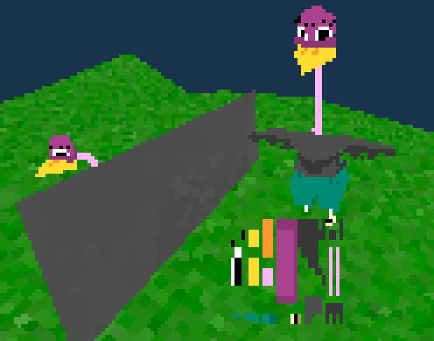

# Eendgine



```
 ____________________________________ 
/ Welcome to Eendgine! A work in     \
|  progress 3D engine made in C++    |
|  using OpenGL.                     |
| Features include:                  |
|  * 3D & 2D elements                |
|  * load in animations from objs    |
|  * Interpolation for animations    |
|  * Always facing sprites           |
|  * Collision code                  |
|  * Post processing shaders         |
|                                    |
| Special thanks to the following    |
|  for enabling me:                  |
|   * github.com/Barnold1953         |
\   * learnopengl.com                /
 ------------------------------------ 
   \ 
     >()
      (v >
       ^^
```

## Instalation

### Requirements
- cmake
- SDL2
- assimp
- glad 

Glad files need to be generated for your system. See lib/glad/README.txt

### Building
```
git clone https://github.com/daviddwk/Eendgine.git
cd Eendgine
mkdir build
cd build
cmake ..
make
cd ..
```

### Executing

Just run game.out!
```
./game.out
```
